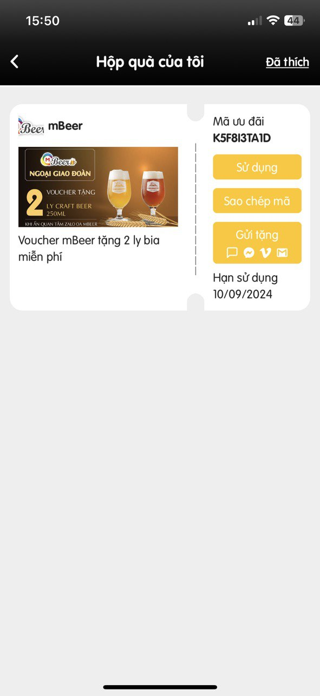
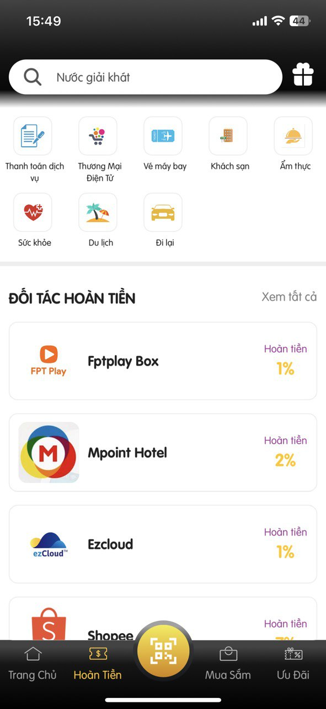
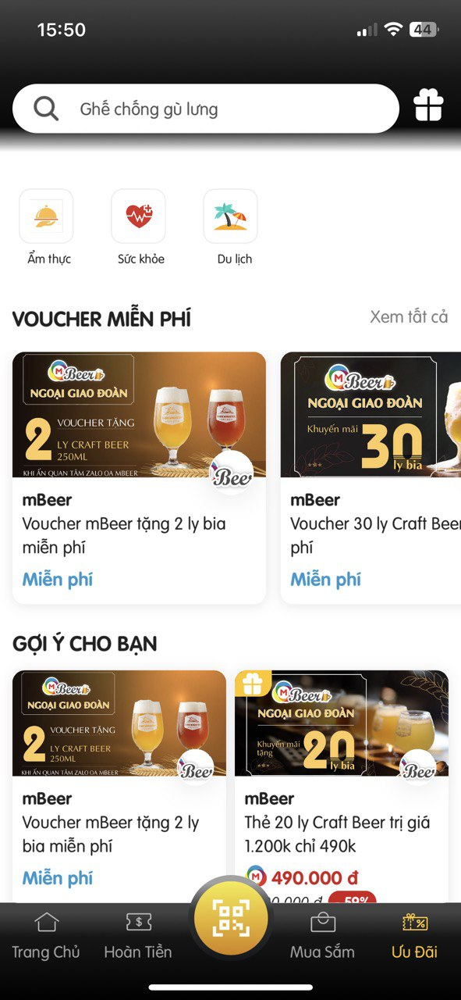
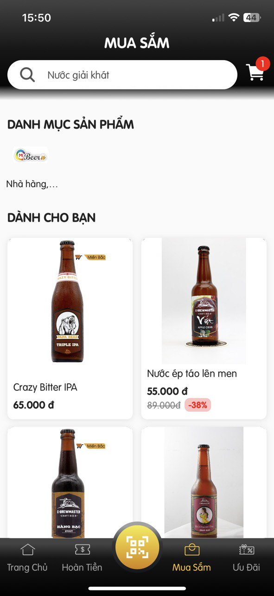
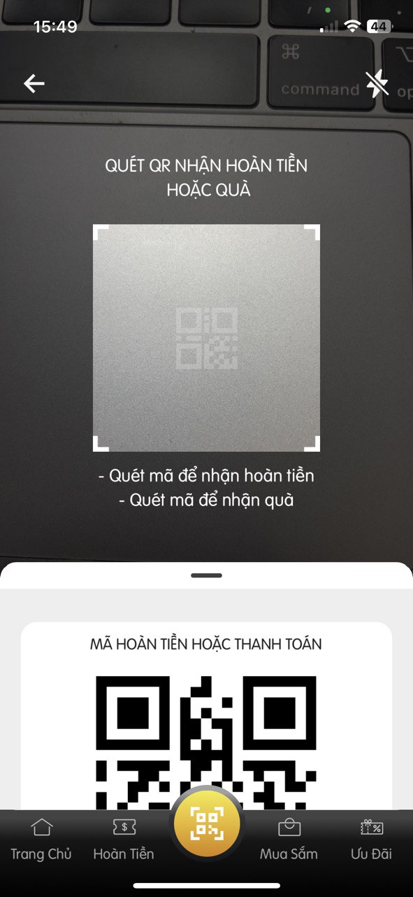

# Enhance concentration and improve health

“Khai phóng” is an application that helps users relieve stress and improve concentration through meditation exercises. The application provides courses according to the roadmap, users can easily listen and manage lessons.

- [GetStream](https://getstream.io/) for third party support chats and send message, gif, images
- [Firebse](https://firebase.google.com/) for authentication, database.
- [Tamagui](https://tamagui.dev/) for UI config
- [Expo Router](https://docs.expo.dev/router/introduction/) for router.
- [Lucide Icons](https://tamagui.dev/ui/lucide-icons/1.0.0) for icons

## Screenshots

## Demo

<!-- 

 -->

